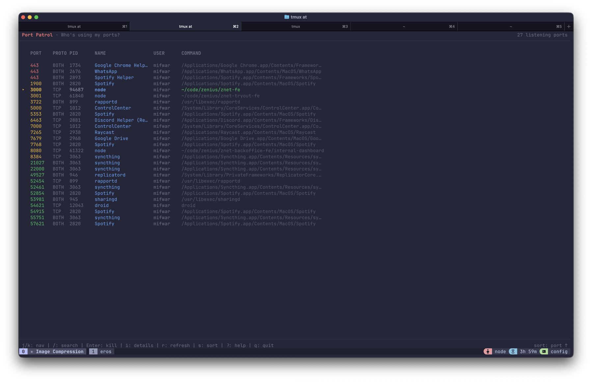

# Port Patrol

[](https://www.npmjs.com/package/port-patrol)
[](https://opensource.org/licenses/MIT)
[](https://nodejs.org)

A terminal UI to inspect listening ports and terminate the owning process.

Built with [Ink](https://github.com/vadimdemedes/ink) + [React](https://react.dev).



## Features

- **List all listening ports** with process info
- **Search/filter** by port number or process name
- **Kill processes** with optional force kill (SIGKILL)
- **Sort** by port, PID, or process name
- **Color-coded ports** (system < 1024, registered < 10000, dynamic)
- **Cross-platform** (macOS, Linux, Windows)

## Installation

```bash
# Run directly
npx port-patrol

# Or install globally
npm install -g port-patrol
pp
```

## Usage

```bash
# Open TUI
pp

# Quick search for port 3000
pp 3000
```

### Keyboard Shortcuts

| Key       | Action                    |
| --------- | ------------------------- |
| `j / ↓`   | Move down                 |
| `k / ↑`   | Move up                   |
| `g`       | Jump to top               |
| `G`       | Jump to bottom            |
| `/ or f`  | Search/filter             |
| `Enter`   | Kill selected process     |
| `K`       | Force kill (SIGKILL)      |
| `r`       | Refresh list              |
| `s`       | Toggle sort field         |
| `o`       | Toggle sort order         |
| `Esc`     | Clear search / Close      |
| `?`       | Show help                 |
| `q`       | Quit                      |

### Port Colors

- **Red** - System ports (< 1024) - usually need sudo to bind
- **Yellow** - Registered ports (< 10000)
- **Green** - Dynamic/private ports (>= 10000)

## Development

```bash
npm install
npm run dev

# Build
npm run build
```

## License

MIT
